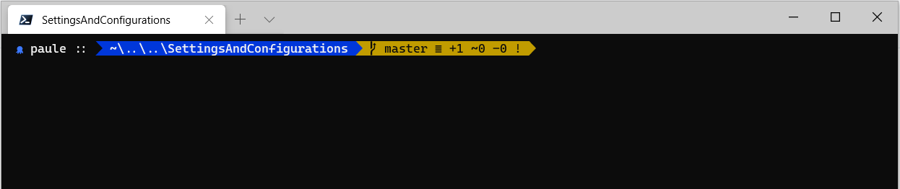
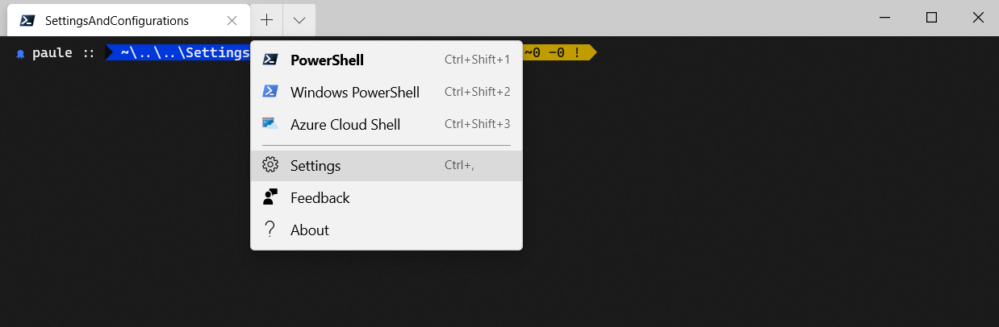

# SettingsAndConfigurations

Hello! This is a repository to hold all of my custom settings and configurations for various IDEs, projects (when standard) and terminals. Each of the sections below explain my current settings & configs.

# Installation (script is WIP)

This installation is currently very dumb and will simply overwrite any settings you have in place with the same file. (This applies mainly to git bash at this time).

**Windows**

    # Run the following in powershell to install in your home directory
    $USER = $env:USERPROFILE;
    git clone git clone git@github.com:paulegradie/SettingsAndConfigurations.git $USER/.SettingsAndConfiguration
    python $USER/.SettingsAndConfiguration/script/install.py

**Other**

TBD

## Windows Terminal

To set up windows terminal with custom prompt themeing and git support, you'll need to install [Oh-My-Posh](https://github.com/JanDeDobbeleer/oh-my-posh) and [Posh-Git](https://github.com/dahlbyk/posh-git). This will give you the sweet command line prompt styling and it comes with several predesigned themes that you can choose from.

I've taken the AgnosticSlim theme and slightly modify to my liking - which includes adding in an octopus icon when elevated privelages are set (i.e. Run as Administrator).

#### Octopus Deploy Custom Font

To enable this octopus icon, you'll need to install a custom font which has the octopus icon assigned to one of the font's hex values (e.g. 0x80). You can use the font I've provided under `FontWithOctopusDeployIcon`, or you can create your own:

1. Download CascadiaCodePLOctomized.tff
2. Double click and install.
3. Take note of the font name in the install window, you'll need this for the terminal settings.

If you don't like the CascadiaCode base font, you are free to customize another font. However, to keep the theme working for `Posh-Git`, you are currently a bit limited to using either CascadiaCode or CascadiaCodePL (since it has the pipe symbols required for git) -- feel free to explore this... there may be other fonts that support git, but I haven't looked into it.

Once you have the font installed, you just need to specify it in the `settings.json` for Windows Terminal. In the `WindowsTerminal` directory, you'll find the `settings.json` file that I use. To access your file, you can open Windows Terminal and press (Cntl + ,) or use:

I've uploaded the `WindowsTerminal/settings.json` that I use with the above font installed and specified for Powershell (not Windows Powershell, or Azure Cloud Shell, or Command Prompt). You can see how each shell type supported by Windows Terminal is specified in an array in the json file. Feel free to copy this file and customize it to your liking -- or simply customize the one you already have.

If you are wondering where this file is, its probably located a path similar to:

    %USERPROFILE%\AppData\Local\Packages\Microsoft.WindowsTerminal_8wekyb3d8bbwe\LocalState\settings.json

You can also find this file when opening it from Windows Terminal.

#### Setting the theme in your profile

Lastly, you need customize the `Oh-My-Posh` theme. I've customized the AgnosticSlim theme an renamed it `Acgnocto.psm1` (since it used the octopus icon). You are welcome to download this file and place it your theme directory in `Oh-My-Posh`. This will likely be located at:

    %USERPROFILE%\Documents\PowerShell\Modules\oh-my-posh\2.0.412\Themes

#### And thats it!

## Git Bash

My git bash setup relies on having `~/.bashrc` and `~/.bash_profile` located in the home directory. These will each reference the version found in `.SettingsAndConfigurations`. e.g.:

// ~/.bashrc

    #!/usr/bin/env bash
    source .SettingsAndConfigurations/GitBash/.bash_profile

// and ~/.bash_profile

    #!/usr/bin/env bash
    source ./.SettingsAndConfigurations/GitBash/.bash_profile

With these ceated, everything should work.
